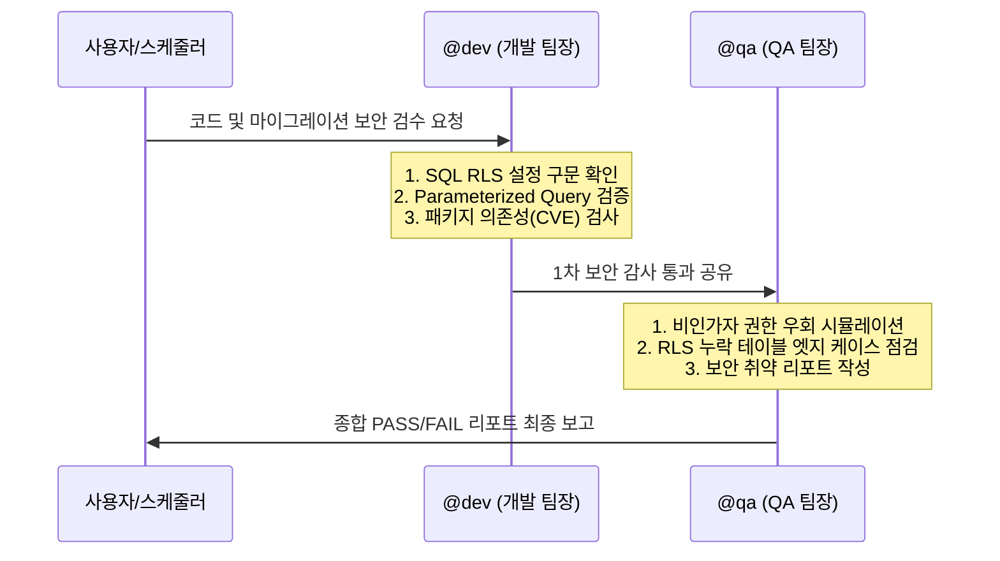

# 🔒 Supabase DB 마이그레이션 & RLS 보안 감수 가이드

이 워크플로우는 사용자가 수동으로 `/secure_db` 명령어를 실행하거나, 정기적인 예약 스케줄러(Cron)를 통해 전체 데이터베이스와 코드베이스의 보안 상태를 진단할 때 동작합니다. 

특히 Supabase RLS(Row Level Security) 설정 누락, SQL Injection 취약점, 그리고 의도치 않게 임시로 비활성화된 보안 정책을 사전에 완벽히 걸러내는 것을 목표로 합니다.

---

## 👥 전문 에이전트 협업 체인

보안 감수는 극도로 철저해야 하므로, 개발 팀장(`@dev`)의 정적 검사와 QA 팀장(`@qa`)의 모의 권한 침투 시나리오 검증이 결합되어 진행됩니다.

---

## 🛠️ 실행 및 진단 지침 (Step-by-Step)

### 1. 변경점 탐색 및 환경 스캔
- **[수동 실행 시]** 최근 추가되거나 수정된 `.sql` 마이그레이션 파일 및 DB 쿼리 관련 API 파일(`*.ts`, `*.js`, `*.py`)을 스캔합니다.
- **[주기적 스케줄러 실행 시]** 로컬 내 모든 SQL 스키마 정의서와 패키지 구성 요소 전체를 정밀 스캔하고, 실시간 DB 접속이 가능한 경우 테이블 카탈로그의 RLS 활성화 유무를 탐지할 계획을 세웁니다.

### 2. @dev: 개발 보안 가이드라인(Security Audit) 준수 여부 정적 진단
개발 가이드라인의 **보안 수칙**에 근거하여 다음을 한 줄씩 감사(Audit)합니다.
- **RLS 필수 적용 규칙**: 신규 테이블 생성 시 `ALTER TABLE ... ENABLE ROW LEVEL SECURITY;` 문구가 누락되었는지 확인합니다.
- **SQL Injection 방지**: 사용자 입력을 받아 동적으로 SQL 쿼리를 어셈블리(String concatenation)하는 부분이 없는지 점검하고, 항상 Parameterized Query(파라미터 바인딩)가 적용되도록 가이드합니다.
- **클라이언트 키 검증**: 익명 키(`anon key`)가 클라이언트 사이드 외부로 유출되거나, 높은 권한을 가진 `service_role key`가 실수로 프론트엔드 환경 변수나 컴포넌트에 하드코딩되지 않았는지 철저히 검사합니다.
- **패키지 보안 진단**: 주기적 실행 시 `npm audit` 또는 관련 파이썬 가상환경 보안 검사를 수행하여 외부 모듈 취약점이 보고되었는지 체크합니다.

### 3. @qa: 권한 침투 시나리오 및 예외 상황 검증
QA 팀장은 아래와 같이 실제 해커나 악의적인 유저가 접근을 시도할 때 발생할 수 있는 구체적인 시나리오를 적용하여 엣지 케이스를 테스트합니다.
- **시나리오 A (비인가 조회)**: 로그인하지 않은 비로그인 유저가 API 엔드포인트 세션을 우회하여 관리자 전용 정보나 가려진 데이터(`is_hidden = true`)를 억지로 조회할 수 있는지 RLS 조건식을 역검증합니다.
- **시나리오 B (타인 정보 조작)**: 로그인한 일반 사용자가 본인이 소유하지 않은 타인의 북마크, 리뷰 데이터를 직접 수정/삭제(UPDATE/DELETE)하는 패킷을 날릴 때의 방어 여부를 검사합니다.
- **시나리오 C (임시 비활성화 감지)**: 개발 및 마이그레이션 과정에서 일시적으로 비활성화한 RLS 정책(`DISABLE ROW LEVEL SECURITY`)이 프로덕션 적용 시점에 실수로 방치된 경우가 없는지 체크리스트를 대조합니다.

---

## 📝 최종 검수 리포트 작성 표준

진단이 완료되면, 에이전트는 한글로 작성된 고가독성의 종합 리포트 표를 생성하여 보고해야 합니다.

| 진단 영역 | 검증 항목 | 상태 | 검증 상세 및 보완 의견 |
| :--- | :--- | :---: | :--- |
| **DB 스키마** | Row Level Security (RLS) 활성화 | `PASS / FAIL` | (예: `books` 테이블 RLS 구문 정상 확인 / `users_temp` RLS 누락 발견) |
| **쿼리 무결성** | SQL Injection 방어 구조 준수 | `PASS / FAIL` | (예: 모든 CRUD 로직에 Prisma/Supabase ORM 파라미터화 적용 확인) |
| **API 보안** | 민감 정보 및 마스터 키 유출 검증 | `PASS / FAIL` | (예: 프론트엔드 내 `service_role` 키 노출 정황 없음) |
| **패키지 관리** | 의존성 라이브러리 보안 취약점 | `PASS / FAIL` | (예: npm 패키지 긴급 보안 패치 권장 사항 0건) |
| **권한 우회 QA** | 타인 데이터 및 임시 우회 시나리오 | `PASS / FAIL` | (예: 타인 세션을 통한 쓰기 공격 시 정상 에러 반환 검증) |

> ⚠️ **FAIL 판정 시 조치**: 단 하나의 항목이라도 `FAIL`이 발생할 경우, 즉시 수정 권장 코드 또는 조치해야 할 SQL 스크립트를 작성하여 제공하고 보안 안전이 확보될 때까지 검수를 종결하지 않습니다.
