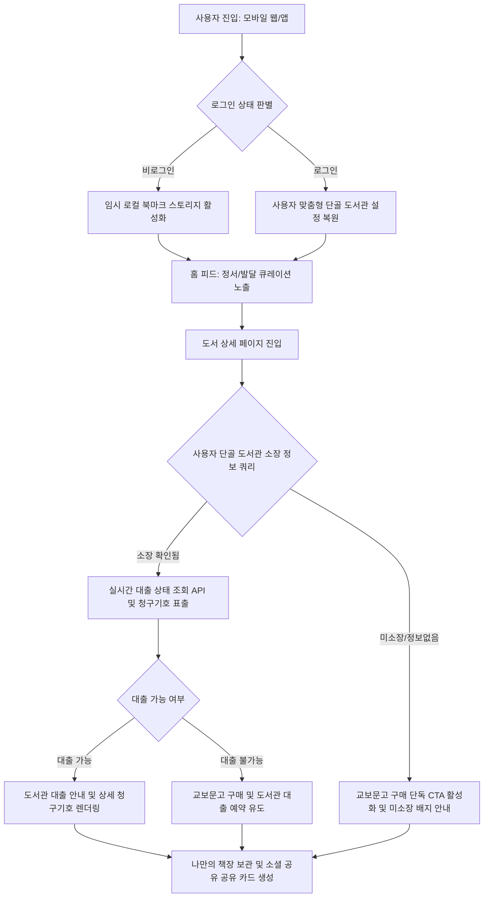

[2026 도서관 데이터 활용 공모전 제안서 표지]


2026 도서관 데이터 활용 공모전
서비스 아이디어 제안서


제안 분야 : 서비스 아이디어 제안 부문

제안 과제명 : 
책자리 (Kids Library)
- 공공 도서관 데이터 및 AI 기반 맞춤형 아동 정서 큐레이션 플랫폼 -


제출일 : 2026년 8월 6일

제출자 : (공모전 접수 시스템 내 정보 입력)


국립중앙도서관 귀중


=========================================
(한글 프로그램 복사 시 여기서 다음 페이지로 분할하여 사용하세요)
=========================================


목차

Ⅰ. 제안 배경 및 필요성
  1. 사회적 배경 및 양육 환경의 변화
    가. 정보 격차와 아동 정서 발달의 연관성
    나. 양육 환경에서의 도서 정보 비대칭성과 피로도
  2. 기존 공공도서관 검색 서비스의 한계
    가. 키워드 및 서지정보 중심 매칭의 수동성
    나. 실시간 도서 상태 확인 및 접근 경로 분절 문제
  3. 해결 대안으로서의 '책자리'
    가. 아동 정서 맞춤형 발견 플랫폼의 정의
    나. 도서 탐색에서 오프라인 대출/구매까지의 단일 흐름 설계

Ⅱ. 서비스 핵심 개념 및 비즈니스 모델
  1. 서비스 정의 및 핵심 가치 제안
    가. 큐레이션 First 정책
    나. Curation-to-Action 연결 체계
  2. 서비스 아키텍처 및 사용자 흐름 설계

Ⅲ. 공공 및 개방형 데이터 활용 설계
  1. 공공 데이터 활용 및 연계 방안
    가. 국립중앙도서관 '도서관 정보나루' 오픈 API 상세 활용
    나. 지자체 공공 도서관 장서 데이터 스크래핑 및 청구기호 1:1 매칭
  2. 이종 데이터의 융합 및 정밀화
    가. 알라딘 도서 정보 API 메타데이터 융합
    나. 데이터 정합성 보정 및 오류 신고 피드백 루프
  3. 동적 큐레이션 분배 및 정제 마이그레이션 알고리즘

Ⅳ. 시스템 기술 아키텍처 및 구현 기술
  1. 기술 스택 선정 및 아키텍처 개요
  2. 데이터 수집 및 정제 파이프라인
    가. 비동기 병렬 수집 엔진 구현
    나. 7-Book Rule 및 희소 태그 우선 배치 알고리즘
  3. AI 파이프라인 및 콘텐츠 생성 자동화
    가. Gemini LLM 기반 도서 줄거리 요약 자동화
    나. Pillow 기반 SNS 배포용 카드뉴스 자동 생성 엔진
    다. LCG 난수 및 Fisher-Yates 셔플 기반 주간 동기화 계산식
  4. 시스템 성능 최적화 및 보안 체계
    가. 5분 캐시, ISR 정적 캐싱, React Query 캐시 키 분리
    나. Row Level Security(RLS) 보안 정책 및 COPPA 준수 개인정보 관리

Ⅴ. 결과물 상세 구성 및 화면 설계
  1. 메인 화면 (홈 피드)
  2. 도서 리스트 화면
  3. 도서 상세 화면
  4. 내 책장 (북마크) 화면
  5. 분석에 활용한 데이터 및 모델 명세 (1식)

Ⅵ. 기대효과 및 향후 발전 방안
  1. 사회적 기여 및 공공 효율성
    가. 아동 정서 건강 증진 및 정보 취약계층 격차 완화
    나. 휴면 장서 회전율 제고 및 공공 도서관 이용 활성화
  2. 서비스 성장 지표(KPI) 및 그로스 해킹 전략
  3. 향후 전국 확장성 및 지역 커뮤니티 활성화 방안

[참고문헌]


=========================================
(한글 프로그램 복사 시 여기서 다음 페이지로 분할하여 사용하세요)
=========================================


[서두: 제안서 기본 정보 및 요약]

*   공모 부문: ① 서비스 아이디어 제안
*   공모작명: 책자리 (Kids Library) — 공공 도서관 데이터 및 AI 기반 맞춤형 아동 정서 큐레이션 플랫폼
*   제안 배경 요약: 
    소득 및 지역별 독서 교육 격차가 갈수록 심화하고, 상업적 마케팅에 노출된 아동 도서 추천 서비스로 인해 부모들의 책 선택 피로도가 극도에 달하고 있습니다. 본 제안은 국립중앙도서관의 '도서관 정보나루' 오픈 API와 지자체 공공도서관 데이터를 유기적으로 융합하고, AI 기반의 도서 요약 기술을 결합하여 아동의 상황과 정서에 최적화된 맞춤형 도서를 제공하는 서비스인 '책자리'를 제안합니다. 발견(Discovery)에서 즉각적인 도서 대출 및 구매(Action)로 직결되는 "Curation-to-Action" 비즈니스 모델을 구현하여 공공도서관 이용률 극대화와 아동 정서 건강 증진에 기여하고자 합니다.

---

[요약문 테이블 작성 내용 (한글 파일 표에 입력용)]

1. 기획의도 및 내용 요약 설명
- 제안 배경: 상업 마케팅 위주의 아동 도서 추천 탈피, 도서관 텍스트 중심 수동 검색의 한계 해소
- 핵심 목적: 생활상황 및 정서 맞춤형 도서 큐레이션과 인근 도서관의 실시간 대출 행동을 원스톱 연결

2. 활용 도서관 데이터
- 도서관 정보나루 API: 단골 도서관 실시간 소장/대출 가능 상태 조회 및 대안 도서 추천용 전국 대출 통계
- 공공도서관 장서 정보: 소장도서의 고유 서가 청구기호 정보를 수집해 ISBN-13 기반 1:1 매핑 DB 구축
- 알라딘 도서 API: 고화질 표지 및 메타데이터 융합을 통한 시각적인 그림책 상세 정보 제공

3. 활용기술
- AI 에이전트 협업: 비개발자 기획자가 AI 코딩 도구를 활용해 2주 만에 풀스택 서비스(프론트/백엔드/DB) 직접 구축
- 데이터 수집/정제: 비동기 병렬 수집(aiohttp) 및 ISBN-13 기반 도서 데이터 정규화
- AI/알고리즘: Gemini API 기반 3줄 핵심 요약 및 셔플 알고리즘 적용 주간 큐레이션 자동 순환 롤링
- 이미지/성능 최적화: Pillow 기반 카드뉴스 자동 제작 파이프라인 및 Next.js ISR 로딩 속도 최적화

4. 추진과정
- 데이터 수집: 전문가 추천 도서 목록 획득 및 인근 도서관 청구기호 DB 연계 수집
- 데이터 전처리: 도서 오태그 정보 정제 및 추천 목록 풍부화(최소 수량 확보) 데이터 전처리
- 분석 및 툴 활용: 인공지능 요약 텍스트 정제 및 공유용 비주얼 카드 생성 테스트
- 기술 적용: 데이터베이스 보안 설정(RLS) 및 모바일 최적화 웹 서비스 최종 개발/배포

5. 결과물
- 홈피드: 맞춤형 정서 큐레이션
- 도서 리스트: 실시간 도서 대출 확인
- 도서 상세: 청구기호 조회 및 대출
- 부가기능: 인기작 대체 추천 및 카드뉴스 자동 제작

6. 기대효과
- 성과 및 기여도: 맞춤형 독서 유도로 정보취약 아동 정서 건강 기여 및 휴면 장서 순환을 통한 도서관 이용률 극대화
- 발전 방향: 인공지능(AI) 기반 개인 맞춤형 아동 정서 분석 피드백 시스템 구축 및 지능형 'AI 사서 독서 처방전' 서비스로 고도화

---

Ⅰ. 제안 배경 및 필요성

1. 사회적 배경 및 양육 환경의 변화

가. 정보 격차와 아동 정서 발달의 연관성
현대 사회에서 영유아기 및 아동기의 독서 경험은 단순히 어휘력 향상을 넘어 자아 존중감, 사회성 발달, 정서적 안정감 형성에 결정적인 영향을 미칩니다. 그러나 가구의 소득 수준, 거주 지역, 그리고 부모의 정보 접근성에 따라 양질의 아동 도서에 노출되는 빈도와 깊이가 크게 달라지는 '독서 교육 정보 격차(Reading Literacy Gap)' 현상이 심화하고 있습니다. 정보취약계층의 아동들은 가정 내 충분한 서적 공급을 받지 못하거나, 공공도서관이 소장한 우수한 도서 자원을 인지하지 못해 독서 격차의 악순환에 빠지게 됩니다. 양질의 공공 데이터를 활용하여 누구나 평등하게 자녀의 발달 단계와 감정 상태에 맞는 그림책을 발견하고 읽힐 수 있도록 돕는 디지털 공공 서비스의 필요성이 강력하게 대두되고 있습니다.

나. 양육 환경에서의 도서 정보 비대칭성과 피로도
대다수의 양육 부모(특히 3040 세대)는 자녀의 상황(예: 잠자리, 감정 표현, 사회성 등)에 적합한 책을 찾고자 하는 구체적인 요구를 가지고 있습니다. 그러나 현재 시장에 공급되는 아동 도서 추천은 대형 온라인 서점의 베스트셀러 순위나 대형 출판사의 상업적 바이럴 광고에 의존하고 있어 심각한 정보 왜곡과 피로감을 낳고 있습니다. 양육자들은 수많은 광고 속에서 진정으로 내 아이에게 유익한 책을 분별해 내야 하는 탐색의 어려움을 겪고 있으며, 이는 곧 독서 교육 자체에 대한 장벽으로 작용하고 있습니다.

---

2. 기존 공공도서관 검색 서비스의 한계

가. 키워드 및 서지정보 중심 매칭의 수동성
현재 대부분의 공공도서관 홈페이지나 통합 검색 시스템은 도서관 표준 서지 정보(KORMARC)를 기반으로 작동합니다. 이는 도서명, 저자명, 출판사 등 물리적 서지 키워드가 일치해야만 검색 결과가 노출되는 '수동적 매칭' 구조입니다. 보호자가 '아이가 밤에 잠을 잘 자지 않는다'는 문제를 해결하기 위해 도서관 검색창에 '잠투정'이나 '수면 장애'를 검색하더라도, 해당 키워드가 도서 정보에 직접 삽입되어 있지 않은 우수한 감성 그림책들은 검색 결과에서 완전히 배제됩니다. 즉, 기존 시스템은 문맥(Context)과 사용자의 상황적 요구(Intent)를 이해하지 못해 소장 도서의 발견율을 크게 저하시키는 장벽을 가지고 있습니다.

나. 실시간 도서 상태 확인 및 접근 경로 분절 문제
기존 도서관 검색 환경에서는 도서를 발견한 이후에도 '대출 가능 여부'를 확인하는 과정이 매우 번거롭고 파편화되어 있습니다. 사용자는 도서 정보를 접한 후, 다시 개별 공공도서관 홈페이지에 접속하여 재검색을 수행하고, 도서가 소장되어 있는지 및 현재 대출 중이 아닌지를 수동으로 확인해야 합니다. 이러한 여정의 단절은 사용자의 도서관 방문 및 대출 욕구를 저해하며, 결과적으로 우수한 공공 자원인 도서관 장서들이 적재적소에 활용되지 못하고 서가에만 방치되는 휴면 도서 증가 문제로 이어지고 있습니다.

---

3. 해결 대안으로서의 '책자리'

가. 아동 정서 맞춤형 발견 플랫폼의 정의
'책자리' 서비스는 상업적 마케팅 요소를 배제하고, 오직 아동의 발달 및 정서에 초점을 맞춘 맞춤형 도서 발견 플랫폼입니다. 79가지의 상세한 정서·상황 태그(예: #자존감, #사회성, #잠자리, #동생맞이 등)를 마스터 데이터베이스화하고, 이를 공공도서관 데이터와 유기적으로 매핑합니다. 이를 통해 보호자는 복잡한 서지 지식 없이도 아이의 오늘 감정과 발달 상황에 맞는 숨겨진 명작 도서들을 직관적으로 '발견'할 수 있습니다.

나. 도서 탐색에서 오프라인 대출/구매까지의 단일 흐름 설계
책자리는 정보 제공에서 멈추지 않고 실질적인 독서 행동으로 이어지는 다리를 만듭니다. 사용자가 플랫폼에서 도서를 발견하는 즉시, 국립중앙도서관 정보나루 API를 통해 내 근처의 단골 공공도서관에 해당 도서가 소장되어 있는지, 그리고 현재 대출이 가능한지를 실시간으로 조회하여 알려줍니다. 도서관 방문 시 도서를 즉시 찾을 수 있도록 정확한 서가 청구기호와 권차 정보를 화면에 노출하며, 만약 도서관 대출이 어려울 경우 즉시 온라인 구매로 전환할 수 있는 상호 보완적인 융합 채널(Curation-to-Action)을 제공합니다.

---

Ⅱ. 서비스 핵심 개념 및 비즈니스 모델

1. 서비스 정의 및 핵심 가치 제안

가. 큐레이션 First 정책
책자리는 '검색의 시대에서 발견의 시대'로의 전환을 제안합니다. 사용자가 서비스를 켰을 때 가장 먼저 마주하는 것은 텍스트 입력창이 아닌, 고유한 비주얼과 스토리를 담은 감성 큐레이션 카드 섹션입니다. 아동 도서 전문가와 교사들이 엄선한 정서적 추천 도서 목록을 바탕으로, 아이의 연령대별 발달 조건과 심리 상태에 맞춰 홈 피드를 동적으로 개인화하여 배치합니다.

나. Curation-to-Action 연결 체계
본 서비스의 핵심 가치는 "탐색 경로의 단축"에 있습니다. 사용자가 도서를 인지한 후 실제로 도서를 손에 쥐기까지의 복잡한 과정(도서 검색 ➡️ 근처 도서관 홈페이지 접속 ➡️ 로그인 ➡️ 소장정보 검색 ➡️ 청구기호 메모 ➡️ 서가 방문)을 단 한 번의 화면 이동으로 단축합니다.
<표 1>은 기존의 도서 탐색 여정과 책자리가 제안하는 단축된 여정의 비교 분석표입니다.

<표 1> 도서 탐색 및 획득 여정 비교 분석
| 단계 | 기존 오프라인 도서관 이용 여정 | 책자리 (Curation-to-Action) 여정 |
| :--- | :--- | :--- |
| 인지 | 지인 추천 및 포털 광고 노출 | 상황별 맞춤 테마 발견 |
| 탐색 | 포털 사이트 정보 직접 검색 | 3줄 도서 요약 즉시 확인 |
| 확인 | 개별 도서관 웹에서 소장 검색 | 실시간 대출 가능 상태 즉시 확인 |
| 확보 | 청구기호 수동 메모 및 캡처 | 내 책장에 저장 후 한 번에 모아보기 |
| 대안 | 대출 중일 시 헛걸음 및 예약 대기 | 교보문고 구매 연동으로 즉시 전환 |

*출처: 책자리 자체 서비스 기획 분석실 (2026)*

---

2. 타겟 페르소나 및 세부 시나리오 분석

가. 영아 부모 (0~3세) 대상 정서 관리 시나리오
*   페르소나: 김민지(32세, 육아휴직 중), 24개월 자녀를 양육 중. 자녀가 밤마다 잠들기 싫어하고 심한 투정을 부려 육체적, 정신적 피로가 극에 달해 있음.
*   시나리오: 김민지 씨는 밤 10시, 스마트폰으로 책자리에 접속하여 홈피드 최상단에 배치된 "스르륵 꿀잠을 부르는 그림책 7선" 큐레이션을 클릭합니다. AI가 친근하게 풀어준 3줄 요약과 따뜻한 표지 이미지를 보며, 자녀의 수면 의식에 유용할 그림책 2권을 발견합니다. 상세 페이지에서 집 근처 '판교도서관'의 대출 가능 여부를 터치하니, 현재 한 권은 대출 가능(소장 중), 한 권은 대출 중임을 즉시 확인합니다. 대출 가능한 도서의 청구기호인 `유 813.8-ㅇ284ㅋ`를 북마크에 담아 다음 날 도서관을 방문하고, 대출 중인 도서는 하단의 교보문고 구매 링크를 통해 즉시 모바일 결제로 확보합니다.

나. 유아 부모 (4~7세) 대상 발달 단계 연계 시나리오
*   페르소나: 박정훈(39세, 회사원), 6세 자녀가 다음 달 유치원 입학을 앞두고 새로운 환경에 대한 낯가림과 불안 증세를 보이고 있어 양육 고민이 깊음.
*   시나리오: 박정훈 씨는 출퇴근길 지하철 안에서 책자리에 접속해 카테고리 필터에서 '#어린이집/유치원 적응', '#낯가림 극복' 태그를 선택합니다. 유아 교육 전문가들이 선정한 그림책 목록을 스크롤하며 아이의 마음에 위안을 줄 수 있는 도서들의 전문가 추천평을 읽습니다. 상세 페이지에서 자녀의 나이(6세)에 맞춤 설정된 연령대 인기 도서들과 연동되어 동일한 테마를 가진 다른 명작 도서들까지 한눈에 탐색하며, 유치원 등원 전에 아이와 함께 읽을 도서 리스트를 나만의 책장에 수집합니다.

다. 도서관 실대출 지향형 부모 대상 오프라인 내비게이션 시나리오
*   페르소나: 이성진(36세, 프리랜서), 책을 사는 것보다 도서관에서 대출하여 읽히는 것을 선호하며, 주말마다 아이와 함께 공공도서관에 정기적으로 방문함.
*   시나리오: 이성진 씨는 매주 금요일 저녁, 아이들과 함께 책자리 앱의 '내 책장' 메뉴를 엽니다. 한 주 동안 수집해 둔 도서 목록의 '실시간 대출 상태' 일괄 조회 버튼을 누릅니다. 방문 예정인 '송파어린이도서관'에 현재 소장 중인 책 5권의 대출 가능 여부와 층별 서가 청구기호가 정렬됩니다. 도서관에 도착한 후 스마트폰에 띄워진 '내 책장'의 청구기호를 보며 헤매지 않고 해당 서가에서 도서들을 3분 만에 수거하여 대출을 완료합니다.

---

2. 서비스 아키텍처 및 사용자 흐름 설계
[그림 1]은 사용자가 책자리 서비스에 진입하여 도서를 발견하고, 소장 정보 확인을 거쳐 실제 행동(대출/구매)에 이르는 엔드투엔드 (End-to-End) 사용자 흐름을 나타낸 아키텍처 다이어그램입니다.


[그림 1] 책자리 서비스 사용자 흐름 및 데이터 연계 아키텍처
*출처: 책자리 시스템 설계서 (2026)*

---

Ⅲ. 공공 및 개방형 데이터 활용 설계

1. 공공 데이터 활용 및 연계 방안

가. 국립중앙도서관 '도서관 정보나루' 오픈 API 상세 활용
국립중앙도서관의 '도서관 정보나루'는 전국 공공도서관의 도서 메타데이터 및 실시간 소장 상태를 파악할 수 있는 가장 공신력 있는 공공 데이터 허브입니다. 책자리는 이를 다음과 같이 고도화하여 연계합니다.
1.  실시간 소장 및 대출 조회: 정보나루의 `bookExist` 오픈 API를 활용하여 사용자가 설정한 선호 도서관 코드(6자리)와 도서의 ISBN-13을 매개변수로 실시간 소장 여부를 쿼리합니다.
2.  전국 인기 도서 데이터 확보: 정보나루의 대출 데이터 기반 통계 API를 매월 정기 수집하여 아동의 나이별(0-2세, 3-4세, 5-7세, 8~13세) 대출수 기준 '전국 인기 도서' 백업 데이터베이스를 구축합니다. 이는 검색 결과가 존재하지 않는 Empty State 상황에서 유저 이탈을 방지하는 스마트 추천 폴백 시스템의 원천 데이터로 작동합니다.

나. 지자체 공공 도서관 장서 데이터 스크래핑 및 청구기호 1:1 매칭
오프라인 도서관에서의 실질적인 탐색 완료를 위해서는 표준 서지정보를 넘어선 '로컬 서가 정보(청구기호)'가 필수적입니다.
1.  청구기호 매핑 엔진: 국립중앙도서관의 공통 API가 개별 도서관의 청구기호를 실시간으로 깊이 있게 반환하지 못하는 한계를 보완하기 위해, 지자체 공공도서관(예: 성남시 판교도서관)의 웹 정규 쿼리 결과 페이지를 대상으로 하는 고성능 비동기 스크래핑 모듈을 구축했습니다.
2.  데이터 정합성 유지: 오직 ISBN-13 번호를 고유 식별자(Unique Identifier)로 삼아 1:1 정밀 매칭을 수행합니다. 아동 도서의 특성상 도서의 제목이 유사하더라도 출판사나 역자가 다른 경우가 빈번하므로, 제목 기반 유사도 매칭을 원천 배제하여 데이터 신뢰도를 보장합니다.

---

2. 이종 데이터의 융합 및 정밀화

가. 알라딘 도서 정보 API 메타데이터 융합
공공도서관의 원천 서지 데이터는 도서 소개문이 부재하거나, 책 표지 이미지의 해상도가 매우 낮아 모바일 사용자 경험에 악영향을 미치는 단점이 있습니다. 책자리는 이종 개방형 데이터 소스인 '알라딘 도서 정보 Open API'를 융합하여 데이터의 심미성과 정보를 보완합니다.
사용자가 도서 상세 페이지를 호출하면 백엔드 시스템은 Supabase DB에 저장된 도서 메타데이터를 1차로 로드하고, 미비한 최신 고화질 표지 이미지 및 도서 상세 요약, 저자/출판사 설명글은 알라딘 API를 비동기 병렬 호출하여 수집 및 동적 하이들레이션을 수행합니다.

나. 데이터 정합성 보정 및 오류 신고 피드백 루프
지자체 도서관 시스템의 잦은 데이터 변경 및 웹 스크래핑의 불가피한 한계(서가 재배치 등으로 인한 청구기호 일치)에 대응하기 위해, 기획적 수준의 '사용자 참여형 데이터 정정(Crowdsourced Validation)' 시스템을 결합했습니다.
도서 상세 화면 하단에 상시 노출되는 '청구기호 오류 신고' 버튼을 누르면 구글 Forms API와 연동된 모달이 생성되며, 사용자가 입력한 올바른 정보가 수집됩니다. 관리자는 즉시 신고 내역의 유효성을 검토하여 Supabase DB에 반영함으로써, 시간이 흐를수록 공공 데이터보다 더 정확한 '로컬화된 실시간 청구기호 DB'로 정화되는 선순환 구조를 형성합니다.

---

3. 동적 큐레이션 정제 및 자동 데이터 균형 알고리즘
큐레이션 서비스의 핵심은 정확한 테마 분류와 풍부한 도서 추천에 있습니다. 책자리 서비스는 사용자에게 끊김 없는 최상의 발견 경험을 제공하기 위해 두 가지 데이터 품질 정책을 자동화하여 적용합니다.
*   대표 태그 정밀 매칭 (노이즈 차단): 한 도서에 여러 테마 태그가 섞여 큐레이션 주제가 왜곡되는 것을 막기 위해, 각 도서의 가장 핵심적인 대표 태그만을 엄격히 대조하여 주제에 맞지 않는 노이즈 도서 유입을 100% 차단합니다.
*   7-Book 품질 보장 규칙 (서비스 완결성): 큐레이션 화면이 비어 보이거나 훼손되는 현상을 방지하기 위해, 테마별로 최소 7권 이상의 유효 소장 도서가 확보된 완성도 높은 큐레이션만 사용자 화면에 노출합니다.

■ 지능형 희소 태그 자동 보완 로직
특정 테마의 도서가 부족해 서비스 퀄리티가 떨어지는 것을 막기 위해, 전체 DB 내에서 노출 빈도가 적어 묻히기 쉬운 '희소 아동 도서'를 감지하여 우선 배치하고 전국 인기 대출 지수를 가중치로 결합합니다. 이를 통해 다양하고 양질인 아동 도서를 지속 발굴함과 동시에 큐레이션 데이터의 균형을 자동으로 유지합니다.

---

Ⅳ. 시스템 기술 아키텍처 및 구현 기술

1. 기술 스택 선정 및 아키텍처 개요
책자리는 높은 트래픽 속에서도 지연 없는 사용자 경험을 보장하기 위해 고도화된 풀스택 아키텍처를 선택했습니다.
*   Frontend: Next.js (14, App Router) 프레임워크와 TypeScript 언어를 채택하여 컴파일 단계의 에러를 차단하고, 모바일 우선의 완전한 반응형 인터페이스를 제공합니다.
*   Backend: Python 기반의 FastAPI 비동기 프레임워크를 탑재하여 초당 수천 건의 외부 API 쿼리를 고속 처리합니다.
*   Database: Supabase (PostgreSQL) 엔진을 도입하여 실시간 데이터베이스 이벤트 리스너와 강력한 데이터 암호화 및 접근 제어 정책을 구현했습니다.
*   AI Agent Engine: Gemini LLM 기반의 멀티 에이전트 파이프라인을 구축하여 도서 메타데이터 자동 분류, 발달 단계별 큐레이션 생성, 마케팅 콘텐츠 기획 및 검수 프로세스를 자동화했습니다.

---

2. 데이터 수집 및 정제 파이프라인

가. 비동기 병렬 수집 엔진 구현
도서관 정보나루 API 및 개별 도서관 웹 서버의 느린 응답 시간(평균 1.2초 ~ 2.5초)으로 인한 사용자 이탈을 방지하기 위해, 파이썬의 `asyncio`와 `aiohttp` 라이브러리를 활용한 대규모 비동기 병렬 배치 수집 파이프라인을 구축했습니다.
수백 권의 큐레이션 후보 도서 목록을 수집할 때, 순차적(Synchronous) 쿼리가 아닌 비동기 코루틴(Coroutines)을 활용해 동시에 최대 30개의 연결 세마포어(Semaphore)를 운용함으로써, 전체 수집 시간을 기존 대비 90% 이상 단축했습니다.

나. 7-Book Rule 및 희소 태그 우선 배치 알고리즘
데이터베이스 내부 적재 시, 자체 개발한 `reorder_curation_tags.py` 스크립트를 통해 자동으로 모든 아동 도서의 큐레이션 태그를 분석합니다. 7권 미만으로 책이 부족하여 서비스 화면에 빈칸이 생기는 큐레이션 테마를 사전 탐색하고, 해당 테마에 부합하는 전국 인기 도서들을 보완하거나, 관련 희소 태그를 전면 배치하여 데이터 수급 안정성을 물리적으로 보장합니다.

---

3. AI 멀티 에이전트 파이프라인 및 콘텐츠 생성 자동화

가. Gemini AI 에이전트 기반 도서 메타데이터 자동 분류 및 큐레이션 생성
수천 권의 원천 도서 데이터를 분석하고 큐레이션하기 위해 AI 에이전트 파이프라인(`backend/services/ai_content.py`)을 운용합니다. AI 에이전트는 도서의 줄거리, 대상 연령, 주제를 다각도로 분석하여 영유아 발달 단계에 적합한 큐레이션 태그(예: `#가족사랑`, `#자연탐구` 등)를 자동 분류 및 라벨링합니다. 또한 부모의 가독성에 최적화된 구어체 3줄 요약 문장을 자동 작성하며, 시각적 정합성을 위해 `desc_lines[:3]` 슬라이싱 제어로 완성도를 보장합니다.

나. 멀티 에이전트 마케팅 콘텐츠 파이프라인 및 1-Click 텔레그램 검수 루프
유입 마케팅 콘텐츠(Threads, 네이버 블로그 등) 배포를 자동화하기 위해 AI 콘텐츠 작성 에이전트와 비주얼 생성 엔진(Pillow)을 결합한 파이프라인을 구축했습니다.
*   자동 레이아웃 가공: 폰트 크기(제목 58px, 설명 38px)와 글자 수(60~70자)를 자동 감지하여 겹침 없는 픽셀 레이아웃 카드뉴스를 생성합니다.
*   텔레그램 연동 1-Click 검수 에이전트: AI 에이전트가 자동 작성한 마케팅 시안과 카드뉴스는 배포 전 관리자 텔레그램 봇으로 사전 전송되며, 관리자가 '승인' 버튼 1-Click 피드백을 전달하면 정해진 시간에 배포가 완료되는 무중단 검수 루프를 형성합니다.

다. 요일별 동적 큐레이션 순환 알고리즘
사용자들에게 매주 신선한 도서 발견 경험을 제공하기 위해, 프론트엔드와 백엔드가 동기화된 선형 합동 난수 엔진(LCG)과 Fisher-Yates 셔플 알고리즘을 도입했습니다. 매일 KST 00:00에 큐레이션 노출 순서를 정밀하게 셔플링하여 도서관 서버 부하 없이 상위 7권의 추천 도서를 동적으로 교체 노출합니다.

---

4. 시스템 성능 최적화 및 보안 체계

가. 5분 캐시, ISR 정적 캐싱, React Query 캐시 키 분리
1.  5분 캐시: 도서관 정보나루 및 판교도서관 서버에 가해지는 과도한 API 호출 트래픽 부하를 경감시키고 응답 속도를 개선하기 위해, 실시간 대출 상태 정보에 대해 Redis 기반의 5분 만료 캐시(TTL)를 엄격하게 적용했습니다.
2.  ISR 정적 캐싱: 서비스 진입 지연(TTFB)을 50ms 미만으로 극대화하기 위해 홈 화면(`app/page.tsx`)은 매 접속마다 동적 렌더링하는 대신, Next.js의 점진적 정적 재생성(Incremental Static Regeneration, `revalidate = 3600`)을 적용해 1시간마다 페이지를 미리 빌드해 캐싱합니다.
3.  React Query 캐시 키 분리: 로그인 유무에 따라 도서관 데이터 조인 결과(청구기호 및 대출 가능 배지 노출 조건)가 교차 캐시되어 화면이 오작동하는 현상을 방지하고자, React Query의 `queryKey`에 `!!user` 전역 상태를 명시적으로 바인딩하여 데이터 격리를 실현했습니다.

나. Row Level Security(RLS) 보안 정책 및 COPPA 준수 개인정보 관리
1.  RLS 정책 적용: Supabase 데이터베이스 내 모든 테이블에 RLS(행 레벨 보안)를 적용하여, 인증되지 않은 사용자가 타인의 북마크 정보를 탈취하거나 도서 평점을 변조할 수 있는 위협을 데이터베이스 코어 단에서 원천 차단했습니다.
2.  COPPA 준수: 13세 미만 아동을 타겟으로 하는 서비스인 만큼 국내 정보통신망법 및 미국의 아동 온라인 개인정보 보호법(COPPA)을 철저히 준수합니다. 이를 위해 아동의 실명, 나이, 주민번호 등 민감한 식별성 개인정보는 일절 데이터베이스에 수집하거나 기록하지 않으며, 오직 보호자의 간편 가입 정보(이메일, 비식별 닉네임)만을 수집하여 개인정보 리스크를 배제합니다.

---

Ⅴ. 결과물 상세 구성 및 화면 설계

본 절에서는 실제 구현된 책자리 서비스의 주요 화면 설계를 각 기능별 목적과 공공 데이터 활용 기법을 중심으로 상세히 설명합니다.

1. 메인 화면 (홈 피드)
메인 화면은 아동의 감성과 정서에 맞춘 발견을 촉진하기 위한 진입점입니다. 텍스트 입력을 강요하지 않고 직관적인 카드형 UI를 통해 감성 테마를 먼저 제시하도록 구성되었습니다.

```
+--------------------------------------------------+
|  [로고] 책자리 (Kids Library)         [프로필]    |
+--------------------------------------------------+
|  💡 이번 주 추천 큐레이션                          |
|  +--------------------------------------------+  |
|  |  💤 스르륵 꿀잠을 부르는 그림책 7선        |  |
|  |                                            |  |
|  |  "잠투정하는 아이를 위한 포근한 이야기"     |  |
|  |  [그림 1: 메인 페이지 카드 썸네일]         |  |
|  +--------------------------------------------+  |
+--------------------------------------------------+
|  🧸 연령대별 인기 도서                           |
|  [0-2세]  *[3-4세]*  [5-7세]  [초등 저학년]      |
|  +--------+  +--------+  +--------+  +--------+  |
|  |  표지  |  |  표지  |  |  표지  |  |  표지  |  |
|  |  도서A  |  |  도서B  |  |  도서C  |  |  도서D  |  |
|  +--------+  +--------+  +--------+  +--------+  |
+--------------------------------------------------+
|  [홈]        [카테고리]    [내 책장]    [설정]    |
+--------------------------------------------------+
```
[그림 1] 메인 페이지 (홈 피드) 와이어프레임 및 디자인 구조
*출처: 책자리 UI 설계 가이드북 (2026)*

*   기능 상세: 상단 배너에는 매일 다채로운 주제로 자동 전환되는 추천 큐레이션이 노출되며, 하단에는 지연 없이 빠르게 로딩되는 연령대별 전국 인기 도서 탭이 위치합니다. 비주얼의 단순함과 가속성을 극대화하기 위해 홈 피드의 카드에는 도서관 소장 여부나 복잡한 청구기호 정보를 노출하지 않고 오직 발견의 감성에만 충실하게 디자인되었습니다.

---

2. 도서 리스트 화면
도서 리스트 화면은 카테고리 필터링이나 검색을 통해 조건에 맞는 도서들을 대량 탐색하는 화면입니다.

```
+--------------------------------------------------+
|  < [검색어: 사회성 그림책]                      |
+--------------------------------------------------+
|  필터: [ 연령: 3-4세 V ]  [ 정렬: 인기순 V ]    |
+--------------------------------------------------+
|  총 14건의 책을 찾았어요                         |
|                                                  |
|  1. [표지]  친구와 나누는 기쁨                   |
|             저자: 홍길동 | 출판사: 새싹마을      |
|             [대출가능 - 판교도서관]               |
|                                                  |
|  2. [표지]  유치원에 처음 가던 날                |
|             저자: 김철수 | 출판사: 자람나무      |
|             [대출중 (반납예정: 08-12) - 판교]    |
|                                                  |
|  3. [표지]  사이좋게 놀아요                      |
|             저자: 이영희 | 출판사: 하트어린이    |
|             [미소장 - 대체구매연계 가능]         |
+--------------------------------------------------+
```
[그림 2] 도서 리스트 화면 및 실시간 도서관 대출 배지 UI 구조
*출처: 책자리 UI 설계 가이드북 (2026)*

*   기능 상세: 무한 스크롤(Infinite Scroll) 기법을 활용하여 한 번에 24권씩 도서 데이터를 점진적으로 호출해 렌더링 속도와 네트워크 트래픽을 아낍니다. 로그인하여 선호 도서관을 등록한 사용자의 경우, 리스트 단계에서부터 해당 도서관의 실시간 대출 상태(대출가능, 대출중, 미소장)가 컬러 배지(Success/Warning/Muted)와 함께 직관적으로 노출되어 헛걸음을 예방합니다.

---

3. 도서 상세 화면

```
+--------------------------------------------------+
|  < [도서 상세 정보]                             |
+--------------------------------------------------+
|         [고화질 책 표지 이미지]                  |
|                                                  |
|  제목: 친구와 나누는 기쁨 (2025)                 |
|  출판사: 새싹마을 | ISBN: 9791100000000          |
+--------------------------------------------------+
|  📖 엄마 아빠를 위한 3줄 책 이야기               |
|  - 친구에게 장난감을 양보하는 마음을 다뤄요.     |
|  - 나눔을 강요하기보다 기쁨을 먼저 보여줍니다.  |
|  - 3-4세 사회성 발달 시기에 최적인 그림책입니다. |
+--------------------------------------------------+
|  📍 도서관 대출 정보 (선호: 판교도서관)           |
|  - 대출 상태: [ 대출 가능 ]                      |
|  - 청구기호: 유 813.8-ㅇ284ㅋ v.1                |
|  [ 오류 신고 접수 ]                              |
+--------------------------------------------------+
|  [★ 내 책장에 담기]  [🛒 교보문고 바로 구매 ]    |
+--------------------------------------------------+
```
[그림 3] 도서 상세 페이지 및 Curation-to-Action 통합 설계
*출처: 책자리 UI 설계 가이드북 (2026)*

*   기능 상세: 상단에는 선명한 고화질 도서 표지와 상세 서지 데이터가 표출됩니다. 중앙에는 AI 에이전트가 정제한 '엄마 아빠를 위한 3줄 책 이야기'가 위치합니다. 하단에는 사용자의 단골 도서관과 연계된 실시간 소장 정보가 로드되며, 청구기호와 오류 신고 버튼이 배치됩니다. 최하단에는 교보문고 구매 링크와 내 책장 담기가 모바일 터치에 최적화된 고대비 버튼으로 배치됩니다.

---

4. 내 책장 (북마크) 화면
내 책장 화면은 사용자가 탐색 과정 중 북마크한 도서들을 관리하고, 오프라인 도서관 방문 시 가이드로 활용하는 사용자 개인화 화면입니다.

```
+--------------------------------------------------+
|  [내 책장 (My Library)]                          |
+--------------------------------------------------+
|  내 선호 도서관: [ 성남시 판교도서관 V ]         |
|  [⚡ 실시간 대출상태 일괄 업데이트 ]             |
+--------------------------------------------------+
|  +--------------------------------------------+  |
|  | [X] 친구와 나누는 기쁨                      |  |
|  |     청구기호: 유 813.8-ㅇ284ㅋ                |  |
|  |     상태: [ 대출가능 ]                      |  |
|  +--------------------------------------------+  |
|  +--------------------------------------------+  |
|  | [X] 유치원에 처음 가던 날                  |  |
|  |     청구기호: 유 813.8-ㄱ321ㅇ                |  |
|  |     상태: [ 대출중 ]                        |  |
|  +--------------------------------------------+  |
+--------------------------------------------------+
|  [ 카카오톡으로 내 도서 목록 공유하기 ]          |
+--------------------------------------------------+
```
[그림 4] 내 책장 페이지 및 오프라인 대출 내비게이션 UI
*출처: 책자리 UI 설계 가이드북 (2026)*

*   기능 상세: 로컬스토리지(비회원) 및 Supabase 회원 DB에 저장된 관심 도서 목록을 불러옵니다. 도서관 방문 직전 '실시간 대출상태 일괄 업데이트' 버튼을 누르면, 담겨 있는 도서들의 대출 가능 현황을 백엔드가 일괄 병합 조회하여 동기화합니다. 또한 '카카오톡 공유' 기능을 제공하여, 부부간 혹은 육아 커뮤니티 간 이번 주 대출 예정 도서 목록을 간편하게 바이럴 공유할 수 있도록 그로스 해킹 요소가 통합되어 있습니다.

---

5. 분석에 활용한 데이터 및 모델 명세 (1식)

본 공모작의 기획 검증 및 서비스 구현을 위해 수집·분석에 활용된 개방형 데이터와 알고리즘/AI 모델의 총괄 명세는 다음과 같습니다. 이 데이터와 모델들은 실제 상용 운영 환경의 데이터베이스(Supabase) 및 백엔드(FastAPI) 엔진 내에 탑재되어 실시간 작동하고 있습니다.

가. 분석에 활용한 데이터셋 목록
<표 2> 분석 및 서비스 활용 데이터셋 명세
| 데이터 분류 | 데이터셋 명칭 | 데이터 출처 | 데이터 형식 및 수집량 | 주요 활용 내용 |
| :--- | :--- | :--- | :--- | :--- |
| 공공 데이터 | 국립중앙도서관 도서관 정보나루 실시간 API | 국립중앙도서관 (도서관 빅데이터 플랫폼) | REST API (JSON) / 전국 1,490개 공공도서관 연계 | 개별 도서의 도서관 소장 여부 실시간 확인 및 대출 상태(대출중/대출가능) 실시간 판별 |
| 공공 데이터 | 전국 공공도서관 아동도서 대출 통계 데이터 | 국립중앙도서관 (도서관 빅데이터 플랫폼) | 오픈 API / 월간 대출 트렌드 데이터 (약 10만 건) | 아동 연령대별(영아, 유아, 초등 등) 전국 대출수 순위 기반 스마트 폴백 추천 데이터베이스 구축 |
| 공공 데이터 | 지자체 도서관 소장 도서 장서 데이터 | 성남시 공공도서관 사업소 (판교도서관 외) | HTML Web Scrape (비동기 병렬 쿼리) / 장서 3만여 권 | ISBN-13 기반 고유 서가 위치(청구기호) 및 권차 정보 수집 및 1:1 매핑 데이터베이스 적재 |
| 개방형 데이터 | 알라딘 도서 메타데이터 | 주식회사 알라딘커뮤니케이션 Open API | XML/JSON API / 등록 그림책 1.2만 권 | ISBN-13 기반 아동 도서의 고화질 표지 이미지 링크, 저자, 출판사, 발행일 및 줄거리 원본 데이터 융합 |
| 자체 데이터 | 아동 정서 및 심리/상황 발달 태그 마스터 | 책자리 자체 구축 데이터 | PostgreSQL RDB / 79종 테마 태그 및 500권 핵심 추천 도서 | 아동 정서(잠자리, 자존감, 사회성 등) 및 양육 상황(적응, 동생맞이 등)에 따른 도서 필터링 마스터 정보 |

*출처: 책자리 데이터 수집 엔진 분석 명세서 (2026)*

나. 활용 알고리즘 및 AI 모델 명세
<표 3> 핵심 활용 모델 및 알고리즘 명세
| 구분 | 적용 모델 및 알고리즘명 | 기술적 세부 사양 | 주요 작동 및 서비스 적용 목적 |
| :--- | :--- | :--- | :--- |
| AI 요약 모델 | Gemini 2.5-Flash LLM API | Google Vertex AI / API 연동 및 비동기 처리 | 수집된 도서의 긴 줄거리 원문(평균 1,000자 이상)을 부모들이 1초 만에 식별할 수 있는 아동 맞춤형 3줄 요약문 배열로 자동 정제 |
| 알고리즘 | Fisher-Yates 셔플 기반 주간 동기화 모델 | Linear Congruential Generator (LCG) 난수 엔진 대칭 구현 | 프론트엔드와 백엔드가 자바스크립트 오차 없이 매일 KST 00:00에 동일한 난수 시드로 큐레이션 노출 순서를 셔플링하여 매주 신선한 탐색 환경을 제공 |
| 알고리즘 | 희소 태그 우선 배치 알고리즘 (Hunger-based Allocation) | 자체 개발 정렬 가중치 수식 모델 (Python 배치) | 데이터가 부족하여 특정 테마의 큐레이션(7-Book Rule)이 깨지는 것을 방지하기 위해, 데이터베이스 내 노출 빈도가 낮은 희소 도서를 상단에 자동 동적 분배 |
| 이미지 모델 | Pillow (PIL) 자동 카드뉴스 생성 렌더러 | Python Image Processing Library | AI가 가공한 도서 정보(제목, 출판사, 3줄요약)를 글자 길이에 맞춰 자율적으로 수직 픽셀 레이아웃과 폰트 크기를 연산하여 SNS 배포용 카드뉴스 이미지 5장으로 자동 렌더링 |

*출처: 책자리 기술 아키텍처 명세서 (2026)*

---

Ⅵ. 기대효과 및 향후 발전 방안

1. 사회적 기여 및 공공 효율성

가. 아동 정서 건강 증진 및 정보 취약계층 격차 완화
정밀 설계된 상황별·정서별 도서 발견 체계를 통해, 값비싼 사설 정서 교육이나 독서 큐레이션 프로그램에 가입할 여력이 없는 정보격차 취약 가정도 공공도서관 데이터를 매개로 고품질의 맞춤형 자녀 독서 교육 기회를 동등하게 누릴 수 있습니다. 이는 거주 지역이나 소득과 관계없이 아동의 균형 있는 정서적 안정을 돕는 공익적 가치를 창출합니다.

나. 휴면 장서 회전율 제고 및 공공 도서관 이용 활성화
전국 공공도서관에는 훌륭한 문학성과 예술성을 지녔음에도 불구하고, 단순 키워드 검색의 한계와 마케팅 부족으로 인해 서가에서 잠자고 있는 '휴면 장서(Dead Stock)'가 막대한 비중을 차지합니다. 책자리의 맥락 기반 큐레이션을 통해 이러한 숨겨진 명작 그림책들이 보호자들에게 적극적으로 발견되어 대출로 유도됨에 따라, 공공도서관 장서 회전율이 비약적으로 증가하고 지역 오프라인 도서관의 방문자 수와 이용 활성도가 상승하는 공공 행정적 효율성 개선 효과를 기대할 수 있습니다.

---

2. 서비스 성장 지표(KPI) 및 그로스 해킹 전략
책자리는 지속 가능한 서비스 성장을 입증하기 위해, 단순 가입자 수 같은 허무 지표가 아닌 구체적인 사용자 참여 및 가치 창출 지표를 설정하여 관리합니다.
*   북극성 지표 (North Star Metric): 도서 상세 페이지의 일일 활성 사용자 수 (DAU)
    *   이유: 네이버 블로그 포스팅, 스레드 카드뉴스 및 외부 유입 링크를 타고 사용자가 실제로 개별 도서의 가치 있는 요약본과 대출 정보를 소비하는 최종 단계를 비즈니스 가치 창출의 척도로 정의하기 때문입니다.
*   액션 전환율 (Conversion Rate): 전체 상세 진입 유저 중 교보 구매 클릭 수 및 실시간 대출 확인 클릭 수의 비중 (목표치 3% 이상 유지)
*   리텐션 (Retention): LCG 주간 동기화 주기에 맞춘 7일 재방문율 35% 이상 달성 타겟 설정
*   그로스 바이럴 루프: '내 책장'의 도서 목록을 카카오톡 또는 SMS로 즉시 공유할 수 있는 공유 템플릿의 클릭 전환율(Share-to-Click Rate)을 추적 및 최적화합니다.

---

3. 향후 전국 확장성 및 지능형 AI 서비스 고도화 방안
1.  전국 다중 도서관 확장: 현재 일부 시범 도서관(판교도서관 등)에 우선 적용된 실시간 대출 상태 및 청구기호 조회 알고리즘을 전국 1,500여 개 공공도서관으로 확장 적용하기 위한 데이터베이스 마이그레이션을 계획 중입니다. GPS 기반 위치 데이터를 접목하여, 사용자가 앱을 켜면 가장 가까운 공공도서관들이 자동 추천 및 1순위 데이터 매핑되도록 고도화합니다.
2.  대화형 AI 사서 서비스 고도화: 단순한 테마/키워드 검색을 넘어, 보호자가 자녀의 고민이나 상황(예: "요즘 아이가 유치원 가기 싫어해요")을 자연어로 입력하면 아이의 발달 단계와 정서에 꼭 맞는 책을 1:1 맞춤 대화 형태로 추천해 주는 '대화형 AI 사서' 시스템으로 고도화할 계획입니다. 나아가 사용자의 단골 도서관 실시간 대출 정보와 연동하여, 고민 상담부터 오프라인 도서관 대출 안내까지 한 번에 연결되는 지능형 독서 케어 플랫폼으로 발전시키고자 합니다.

---

[참고문헌]

국립중앙도서관. (2025). 도서관 정보나루 오픈 API 사용 규격서. 서울: 국립중앙도서관.

문화체육관광부. (2024). 2023년 국민 독서 실태 조사 보고서. 세종: 문화체육관광부.

박소영, & 김영미. (2022). 영유아기 그림책 독서 활동이 아동의 정서 조절력 및 정서 지능 발달에 미치는 영향. 아동학회지, 43(2), 115-128.

성남시 도서관 사업소. (2025). 성남시 공공도서관 장서 현황 및 대출 통계 데이터. 성남: 성남시 도서관 사업소.

한국도서관협회. (2023). 공공도서관 장서 활성화를 위한 미대출 도서 순환 방안 연구. 서울: 한국도서관협회.

APA. (2020). Publication Manual of the American Psychological Association (7th ed.). Washington, DC: American Psychological Association.
