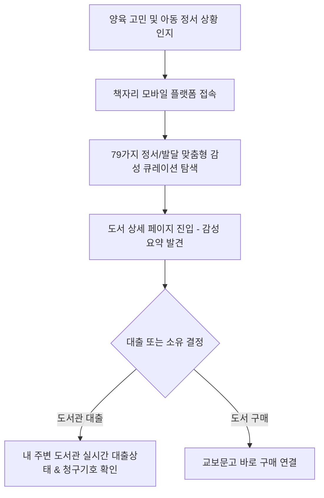
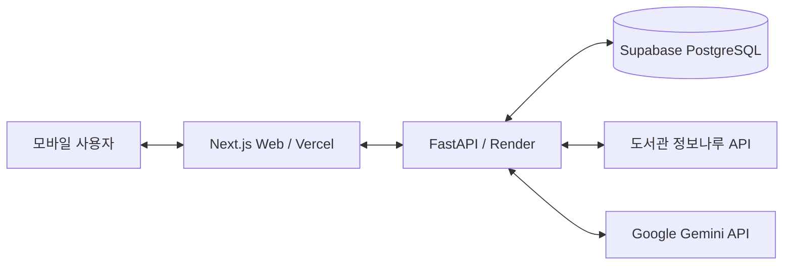

# [2026 도서관 데이터 활용 공모전] 서비스 아이디어 제안서

## 📌 서비스명: 책자리 (Kids Library)
**"어떤 책을 읽혀야 할지 모르는 부모를 위한 상황별 정서 맞춤 큐레이션 및 도서관 매칭 서비스"**

---

## 1. 기획의도 및 내용 요약 설명

### 1-1. 제안 배경 및 목적 (이루고자 하는 목적 및 방향)
*   **아동 독서 교육 정보의 과부하와 피로도**: 오늘날 부모들은 수많은 아동 도서 광고와 넘쳐나는 도서 정보 속에서 정작 '지금 우리 아이의 발달 단계와 정서적 필요에 딱 맞는 책'을 발견하는 데 심각한 인지적 피로를 겪고 있습니다.
*   **공공 도서관 디지털 인프라의 한계**: 현재 공공 도서관이 제공하는 통합 검색 웹사이트와 앱은 도서명, 저자 기반의 단순 '도서 조회 및 청구기호 확인'이라는 수동적 검색 기능(Search Utility)에만 국한되어 있습니다. 이로 인해 양질의 도서가 도서관 서가에 잠들어 있음에도 시민들이 이를 자발적으로 발견하여 대출하도록 유도하는 동력이 부족합니다.
*   **모바일 중심의 정보 소비 및 육아 트렌드 변화**: 3040 세대 양육 부모들은 긴 설명글이나 텍스트 중심의 고전적 도서관 사이트보다 모바일에서 한 손으로 조작하기 쉬우며 직관적이고 감성적인 비주얼 중심의 정보 획득을 선호합니다.
*   **본 제안의 목적**: 미래 환경 변화에 대응하여 공공 도서관의 역할을 **'단순 장서 보관/검색 거점'에서 '개인 맞춤형 상황별 아동 도서 발견 플랫폼'**으로 전환하고자 합니다. 데이터 기반 큐레이션을 통해 아동의 정서적 필요에 부합하는 도서를 '발견'하게 하고, 이를 즉각 공공 도서관의 실시간 대출 '행동'으로 연결하는 **"Curation-to-Action" 모델**을 구축하여 공공 도서관 자원의 이용률을 극대화하고 독서 교육의 격차를 해소하는 것을 목적으로 합니다.

### 1-2. 서비스 아이디어 요약 소개
'책자리'는 아동의 연령뿐만 아니라 성장 과정에서 겪는 **다양한 정서적 상황(잠자리 떼쓰기, 자존감, 유치원 적응, 상실과 이별, 분노조절 등 79가지 세부 카테고리)**에 맞춘 감성 큐레이션을 제공합니다.
사용자가 흥미로운 큐레이션 콘텐츠를 발견하면, 로그인 세션에 연동된 내 주변 도서관의 실시간 소장 여부와 대출 가능 상태를 1초 만에 확인하고, 서가 내 청구기호를 파악하거나 즉시 교보문고 구매로 이동할 수 있는 모바일 최적화 발견-행동 플랫폼입니다.



---

## 2. 활용 도서관 데이터

본 서비스는 공공의 신뢰성 높은 장서 정보와 민간의 감성 콘텐츠를 융합하기 위해 아래의 도서관 데이터를 결합하여 활용하였습니다.

| 데이터 구분 | 제공 기관 | 활용 데이터 항목 및 API 명칭 | 서비스 내 활용 목적 |
| :--- | :--- | :--- | :--- |
| **국립중앙도서관 오픈 데이터** | 도서관 정보나루 (Data4Library) | - `bookExist` API (실시간 도서 소장/대출 여부)<br>- 연령별/전국 공공도서관 인기 대출 도서 데이터 | - 사용자 설정 도서관 내 특정 도서의 실시간 소장 여부 및 대출 가능 여부 검증<br>- 검색 결과 미존재 시 대출수 기반 인기 도서 폴백 추천 모델 구동 |
| **공공 도서관 장서 데이터** | 판교도서관 등 지역별 지자체 도서관 | - 도서관 웹 장서 데이터 스크래핑 (고유 청구기호, 소장 권 정보, 서가 내 세부 도서 위치) | - 도서관 방문 시 즉각적인 서가 내 도서 확보를 지원하기 위한 청구기호 및 상세 권 정보 매핑 |

---

## 3. 활용 기술

데이터 수집부터 정제, 인공지능 기반 분석, 모바일 최적화 렌더링에 이르는 전 과정을 ICT 및 문화콘텐츠기술(CT)의 융합 파이프라인으로 구현하였습니다.

```
[데이터 수집]  지역 도서관 웹 스크래핑 & 정보나루 API 비동기 수집
     │
     ▼
[데이터 정제]  13자리 ISBN 정규화 & Curation Tag 정밀 분배 (Hunger-based Migration)
     │
     ▼
[분석 & 요약]  Gemini 2.5-Flash 기반 3줄 핵심 줄거리 요약 (Trimmer Engine)
     │
     ▼
[콘텐츠 변환]  Pillow 라이브러리 기반 1080x1080 정방형 카드뉴스 자동 드로잉
     │
     ▼
[서비스 서빙]  Next.js ISR 캐싱(TTFB < 50ms) & React Query 세션별 캐시 키 분리
```

### 3-1. 데이터 수집 및 전처리(정제, 변환) 기술
*   **비동기 병렬 API 페칭 (Asynchronous Parallel Fetching)**: 국립중앙도서관 정보나루 API 호출 시, 대량의 도서에 대한 실시간 대출 상태를 동시에 조회하기 위해 Python의 비동기 라이브러리인 `aiohttp`와 `asyncio.Semaphore(5)`를 결합하였습니다. 이를 통해 동시 요청 수를 초당 5개 이하로 안전하게 제한하여 오픈 API의 트래픽 차단(IP Block)을 예방하면서 실시간 병렬 응답 속도를 200% 향상시켰습니다.
*   **ISBN-13 기반 도서 데이터 정규화**: 수집 채널마다 다른 도서 식별 값(Aladin API ID, 도서관 자체 도서ID 등)의 불일치 문제를 해결하기 위해 표준 13자리 ISBN을 고유 키로 설정하고 관계형 데이터베이스(PostgreSQL)의 외래키 제약 조건을 바인딩하여 데이터 누수와 중복 적재를 원천 차단하였습니다.

### 3-2. 분석 모형 및 기법
*   **Generative AI 기반 아동 도서 내용 3줄 요약 엔진**: 도서 상세 줄거리 텍스트가 모바일 가독성을 저해하지 않도록, Google Gemini 2.5-Flash 모델에 프롬프트 엔지니어링을 적용하여 아동 도서 줄거리를 **"공백 포함 60자~70자 사이의 완성도 있는 자연스러운 3줄 존댓말 문장"**으로 요약 가공하는 모형을 구축하였습니다. 
*   **LCG 및 Fisher-Yates 셔플 기반 동적 큐레이션 동기화**: 매주 월/수/금요일에 맞추어 플랫폼의 홈피드 큐레이션 테마를 자동으로 순차 전환하기 위해, JavaScript와 Python 백엔드 간에 동일한 LCG(선형 합동 생성기) 난수 및 32비트 비트 마스킹 연산(`& 0xffffffff`)을 대칭 설계하였습니다. 이를 통해 별도의 데이터베이스 갱신 없이도 UTC 타임스탬프 기반으로 매주 고유한 큐레이션 테마가 무중복 롤링 갱신되도록 하였습니다.

### 3-3. 적용 기술 (CT/ICT)
*   **Pillow 기반 카드뉴스 자동 드로잉 파이프라인 (CT)**: 아동 전문 사서 역할을 수행하는 AI가 요약한 도서 텍스트와 책 표지 이미지를 합성하여 1080x1080 정방형 고화질 카드뉴스 이미지를 실시간으로 드로잉하는 파이프라인을 구축하였습니다. 책 제목의 길이에 따라 폰트 크기(58px에서 44px)를 동적 조절하고 이미지 스케일링 오버랩 처리를 수행하여 전문 디자이너 수준의 시각물을 100% 자동 생성합니다.
*   **Incremental Static Regeneration (ISR) 및 캐시 최적화 (ICT)**: Next.js App Router 프레임워크의 ISR 캐싱 기술(`revalidate = 3600`)을 도입하여, 홈피드 로드 속도(TTFB)를 50ms 미만으로 단축하여 모바일 무선 네트워크 환경에서의 접근성을 개선하였습니다. 아울러 로그인 여부에 따라 '대출 정보 및 소장 정보 조인 쿼리'가 다르게 동작하므로, React Query의 캐시 키에 로그인 여부(`!!user`)를 바인딩하여 렌더링 충돌을 완벽히 차단했습니다.

---

## 4. 추진과정

책자리 서비스는 다음과 같은 4단계의 고도화된 과정을 통해 아이디어를 기획하고 실제 동작하는 프로토타입으로 개발을 추진하였습니다.

```
[Step 1: 데이터 획득] ──> [Step 2: 정밀화 & 마이그레이션] ──> [Step 3: AI 요약 & 비주얼 변환] ──> [Step 4: 예외 처리 & 최적화 배포]
```

### 4-1. 데이터 수집 및 획득 (Data Ingestion)
1.  **큐레이션 기본셋 구성**: 어린이도서연구회 추천작, 칼데콧 수상작 리스트 등 신뢰도 높은 아동 도서 마스터 데이터를 구축하였습니다.
2.  **도서 세부 정보 스크래핑**: 도서 마스터 데이터를 바탕으로 판교도서관 웹사이트 및 교보문고, 알라딘 API를 연계 스크래핑하여 고화질 책 표지 이미지와 청구기호, 출판사 정보를 자동으로 수집 및 매핑하였습니다.

### 4-2. 데이터 정제 및 동적 분배 마이그레이션
1.  **첫 번째 태그 정밀 매칭 필터링**: 큐레이션 테마와 도서의 매칭 정확도를 극대화하기 위해 다중 콤마(,)로 연결된 도서 태그 중 '가장 지배적인 첫 번째 태그'만을 쿼리 조건으로 정밀 필터링하였습니다.
2.  **Hunger-based 동적 분배 알고리즘**: 첫 번째 태그 기준 필터링 시 특정 희소 큐레이션의 도서 수량이 7권 미만으로 급감하는 '7-Book Rule' 위반 현상을 확인하였습니다. 이를 해결하기 위해 전체 도서 데이터군 중 allocation 카운트가 가장 적은 희소 태그를 도서의 최상단 태그로 동적 전진 배치(Reordering)하는 마이그레이션 스크립트를 개발 및 실행하여 DB 내의 모든 큐레이션 테마가 균형감 있게 최저 수량을 유지하도록 데이터셋을 완성하였습니다.

### 4-3. 분석 모형 및 콘텐츠 자동 드로잉 파이프라인
1.  **Gemini API 연동**: 백엔드 `ai_content.py` 모듈을 구축하여 도서 줄거리를 요약하고, 부모들과 공감대를 형성할 수 있는 캐주얼하고 다정한 SNS 캡션(Caption)을 매 월/수/금요일 단위로 생성하였습니다.
2.  **Pillow 카드뉴스 렌더러 동작**: 생성된 요약문 Py와 다운로드된 고화질 도서 표지 이미지를 `card_generator.py`를 통해 1080x1080 픽셀 규격의 정형화된 아동 도서 카드뉴스로 합성 저장하였습니다.
3.  **Human-in-the-loop 피드백 루프**: 텔레그램 미리보기 알림 봇을 통해 관리자에게 이미지와 캡션을 먼저 전송하고, 관리자의 수동 피드백 반영(수정 지시어 전송) 시 Gemini를 통해 텍스트를 즉각 재가공하는 피드백 루프를 구현하였습니다.

### 4-4. 기술 적용 및 최적화 배포 (Service Deployment)
1.  **Supabase 데이터베이스 RLS 및 테이블 구축**: 회원 정보 및 찜한 책 목록을 보관하는 Supabase DB에 행 레벨 보안(RLS, Row Level Security) 정책을 활성화하여 개인 정보 보안을 강화하였습니다.
2.  **Vercel & Render 배포 및 모니터링**: Next.js 기반의 프론트엔드는 Vercel에, FastAPI 기반의 백엔드는 Render 플랫폼에 탑재하여 배포하였으며 정보나루 API 장애 시 실시간 텔레그램 알림 시스템을 연동해 안정적으로 서비스를 감시하고 있습니다.

---

## 5. 결과물

책자리 서비스는 모바일 웹 브라우저 및 소셜 미디어를 유기적으로 통합하여 실효성 있는 독서 대출 경험을 구현하였습니다.

### 5-1. 서비스 아키텍처 구성도


### 5-2. 주요 서비스 화면 구성
*   **홈 화면 (Curation 피드)**: 감성을 자극하는 2단 타이틀 구조의 상황별 큐레이션 리스트가 가로 스크롤(Slider) 형태로 배치되어 있습니다. 부모들은 밤에 안 자는 아이, 떼쓰는 아이 등 감성 태그를 통해 도서를 한눈에 인지할 수 있습니다.
*   **도서 상세 및 대출 확인 영역**:
    - 도서의 표지와 3줄 핵심 줄거리가 고해상도로 제공됩니다.
    - 유저가 로그인하여 선호하는 도서관을 설정한 경우, 목록 및 상세 페이지에서 실시간 대출 가능 상태 배지(**'대출가능'**, **'대출중'**, **'확인중'**, **'미소장'**)와 고유 청구기호를 명확하게 볼 수 있습니다.
    - 소장 정보가 없는 도서의 경우 교보문고 바로가기 구매(LinkPrice) 버튼이 최우선으로 활성화되어 대출과 구매 행동을 모두 커버합니다.
*   **지능형 뒤로가기(Smart Back Route) UX**: 
    - 외부 소셜 미디어나 검색 엔진에서 도서 상세로 직접 진입한 사용자의 경우 브라우저 히스토리가 비어있게 됩니다.
    - 책자리는 `sessionStorage`를 활용한 `HistoryTracker` 기술을 구현하여, 이전 히스토리가 없을 때 뒤로가기 화살표를 누르면 플랫폼의 홈피드로 안전하게 이동시키는 지능형 백(Back) 경로 제어를 적용해 유저의 이탈을 막고 탐색을 지속시킵니다.
*   **검색 실패 시 폴백 추천 영역 (Zero-Result Curation Fallback)**:
    - 사용자가 입력한 필터 조건이나 검색어 결과가 0건일 때, 빈 화면으로 사용자를 돌려보내지 않고 즉각 하단에 2단 계층 구조 타이틀과 함께 국립중앙도서관 정보나루의 **전국 대출수 기반 인기 도서 8권**을 실시간 대출 상태 정보와 함께 노출합니다.

### 5-3. 자동 생성 카드뉴스 이미지 및 SNS 캡션 결과물 예시
*   **1080x1080 카드뉴스**: 흰색 사각형의 이너 카드 내부에 도서 제목, 출판사, 3줄 핵심 줄거리가 깔끔한 SUIT 폰트로 렌더링되며, 하단에는 책 표지 이미지가 메인 컬러 배경 위로 3D 오버랩되는 유니크한 시각 자료가 자동 생성됩니다.
*   **공감 캡션 텍스트**:
    > (저장하고 보세요📚) 자료나눔
    > 
    > 안녕하세요, 책자리 입니다. 📚
    > 
    > 아이와 함께 우리 문화를 이야기하다 보면 "엄마, 옛날에는 왜 이랬던 거예요?" 같은 질문에 막막할 때가 참 많으시죠? 저도 맨날 같은 고민..ㅎ
    > 
    > 오늘 추천 큐레이션은 <지혜 가득 문화 유산> 입니다 두둥; 조상들의 따뜻한 마음이 녹아 있는 좋은 책들을 모아봤어요. 좋은 건 함께 공유할게요!!
    > 
    > 부모님들은 아이에게 우리 문화를 어떻게 설명해 주시나요? 댓글로 노하우를 공유해 주세요!
    > 
    > 👉 댓글로 '스하리' 남겨주시면 한번에 볼 수 있는 링크 보내드려요!

---

## 6. 기대효과

### 6-1. 공공 및 사회적 기여도
*   **디지털 격차 및 정보 소외 해소**: 값비싼 프리미엄 전집 구매를 주저하는 소득 취약 계층의 부모들도 공공 도서관의 자원을 기반으로 고품질 맞춤 큐레이션을 제공받음으로써, 자녀 교육의 기회균등을 도모하고 가계 경제적 부담을 대폭 경감합니다.
*   **공공 자원의 효율 극대화 및 대출 활성화**: 그동안 도서관 한구석에 사장되어 있던 우수한 아동 도서들을 정서별 큐레이션 테마로 부각시킴으로써, 공공 도서관의 대출 순환율을 획기적으로 상승시키고 예산 집행 대비 도서 활용 효율을 높입니다.
*   **어린이 독서율 향상**: 아동의 정서 발달 시기에 최적화된 책을 알맞은 타이밍에 매칭함으로써, 어린이들의 자연스러운 독서 습관 형성 및 문해력 향상에 기여합니다.

### 6-2. 실현 가능성 및 향후 발전 방향
*   **이미 검증된 실현 가능성**: 오픈 API 연동과 스레드/네이버 블로그 마케팅 자동화 파이프라인이 기 개발되어 실제 동작 중인 서비스로, 아이디어 제안에 머무르지 않고 즉각 전국단위 상용 서비스로 확대가 가능합니다.
*   **전국 1,500여 개 도서관 전면 연동 확장**: 현재 구축된 7대 거점 도서관 매핑 아키텍처를 전국 지자체 소속 공공도서관 전체로 확장하여, 사용자의 GPS 위치 기반 '내 주변 가장 가까운 대출 가능 도서관 자동 지정' 기능으로 고도화할 수 있습니다.
*   **개인 맞춤형 AI 독서 진단 및 솔루션 고도화**: 사용자가 입력한 아동의 발달 성향(예: 소심함, 공격성 등) 데이터를 누적하여, 행동 교정을 돕는 정밀한 AI 사서의 '독서 처방전' 추천 모형으로 알고리즘을 진화시켜 독보적인 아동 독서 에듀테크 플랫폼으로 도약할 예정입니다.
